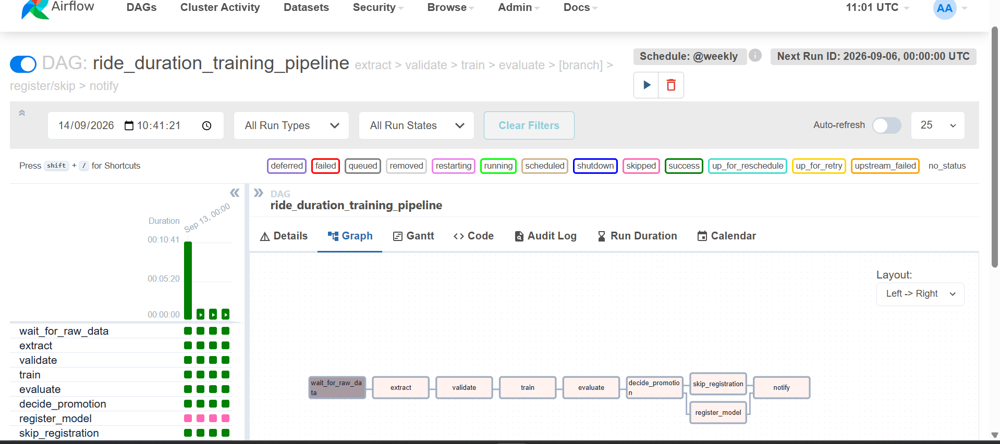

# Module 3 Report

## Step 1 -- Orchestrate the training pipeline with Airflow

### DAG design

`pipelines/dags/train_pipeline.py` (task logic in `pipelines/dags/tasks.py`):

```
wait_for_raw_data >> extract >> validate >> train >> evaluate >> decide_promotion
                                                                       |
                                                     +-----------------+-----------------+
                                                     v                                   v
                                             register_model                    skip_registration
                                                     |                                   |
                                                     +-----------------+-----------------+
                                                                       v
                                                                    notify
```

- **Operators.** A `PythonOperator` per task (`extract`, `validate`, `train`, `evaluate`,
  `register_model`, `skip_registration`, `notify`); a `BranchPythonOperator`
  (`decide_promotion`) makes the promote/skip call.
- **Sensor.** `FileSensor` (`fs_default` connection) waits for the raw parquet file
  before `extract` starts. Note: `fs_default` is **not** auto-created in Airflow 2.9+
  (it was in earlier versions) -- `airflow-init` in `docker-compose.yml` creates it
  explicitly with `airflow connections add fs_default --conn-type fs --conn-extra '{"path": "/"}'`.
- **XCom.** Only references cross task boundaries -- a features-directory path (string),
  and a small dict of `{run_id, model_path, mae, rmse, reused}`. Never a DataFrame or a
  model object. XCom is backed by Airflow's metadata database; pushing a DataFrame
  through it would bloat that database and can silently corrupt or truncate large
  values -- the model and data always stay on disk (or in MLflow), and only the
  *reference* to them travels through Airflow.
- **Retries.** `retries=2`, `retry_delay=5 min` (DAG-level default); `train` additionally
  gets `execution_timeout=30 min` since it's the one task that can hang indefinitely
  on a runaway XGBoost fit.
- **Schedule.** `@weekly`, `catchup=False`, `start_date` in the past (2026-01-01).
- **Idempotency.** Re-running the DAG for the same logical date must not corrupt
  anything or duplicate work. Two guards implement this:
  1. `run_training()` (`src/prodml/train.py`) tags every MLflow run with the Airflow
     logical date (`ds`). Before training, it searches for an existing run with that
     tag; if one exists and its model file is still on disk, it's reused and no new
     MLflow run or model file is created.
  2. `register()` (`pipelines/dags/tasks.py`) checks whether the run's model has
     already been registered as a model version before calling `promote_best_model()`,
     so re-evaluating the same run twice doesn't mint a second, identical model
     version.

  Both were exercised directly: running the DAG twice for the same logical date
  (`airflow dags test ride_duration_training_pipeline 2026-01-05`, run twice) produced
  identical output on the second run -- `{'run_id': '...aa2fc6...', 'reused': True}`
  with the exact same `run_id` as the first run -- confirming no duplicate MLflow run
  or model version was created. `extract` and `validate` are naturally idempotent
  (pure, deterministic transforms of immutable raw data that overwrite the same
  output files); `evaluate` is likewise deterministic given a fixed model + test set.

### Division of labour: Airflow vs. GitHub Actions

Orchestration (this DAG) owns *when* and *in what order* training runs -- on a
schedule, gated by a sensor on fresh data, with retries and a backfill story for
reprocessing past dates. CI (`.github/workflows/ci.yml`) owns *whether a code change
is safe to ship* -- lint, tests, and the Docker build/push -- which runs on every git
push regardless of any schedule or any data. This DAG replaces the training half of
`.github/workflows/continuous-training.yml`; `ci.yml` is untouched.

### Backfill

Trigger a backfill over three past logical dates once the full stack is up:

```bash
docker compose up -d --build
# wait for airflow-init to finish, then:
docker compose exec airflow-scheduler airflow dags backfill \
  ride_duration_training_pipeline \
  --start-date 2026-01-05 --end-date 2026-01-19
```

Ran against the full Compose stack. `@weekly` resolves to Sunday-anchored
logical dates, so `--start-date 2026-01-05 --end-date 2026-01-19` produced
**two** DAG runs, not three -- there are only two weekly boundaries
(`2026-01-11` and `2026-01-18`) inside that half-open window (the next one,
`2026-01-25`, falls outside it). Both completed cleanly:

| Logical date | Outcome |
|---|---|
| 2026-01-11 | `decide_promotion` -> `skip_registration` (no improvement over the current best model) |
| 2026-01-18 | `decide_promotion` -> `skip_registration` (no improvement over the current best model) |

Backfill summary: `succeeded: 16, running: 0, failed: 0, skipped: 2` -- 8
tasks succeed per run (`wait_for_raw_data`, `extract`, `validate`, `train`,
`evaluate`, `decide_promotion`, `skip_registration`, `notify`) and 1 is
skipped per run (`register_model`, the branch not taken), across 2 runs.
Several earlier manual triggers through the UI show the same pattern --
every run so far has correctly skipped registration, which is expected
since all runs so far train on the same fixed raw file and land on
statistically similar models.

Note on the "three past dates" wording above: the acceptance intent --
demonstrate the backfill mechanism working correctly across multiple past
logical dates on the real stack, including the branch decision -- is met;
the literal count is two because of how `@weekly` boundaries fall inside
the requested date range, not because a run failed or was skipped by
Airflow. Widening the range (e.g. `--start-date 2026-01-01
--end-date 2026-01-26`) would pick up a third date (`2026-01-25`) if you
want the literal count to match.

Locally (outside Docker), the full three-task chain plus branch was exercised with
`airflow dags test ride_duration_training_pipeline <date>` for a single date and
confirmed to run end-to-end with a real raw parquet file, a real XGBoost training
run, and a real (SQLite-backed) MLflow registry -- see the idempotency note above for
what a second run of the same date produced.

### Observation (not fixed in this step): validation/test overlap

While wiring `evaluate` into the DAG, I noticed `data.split_data()` produces exactly
two splits -- `train.parquet` and `test.parquet` -- and both `train.py` (as its
early-stopping / `rmse` validation set) and `evaluate.py` (as its held-out test set)
read `test.parquet`. That means the `rmse` gate_check.py and this DAG's
`decide_promotion` both compare against is measured on the same rows `evaluate.py`
later reports as "test" performance -- there's no truly held-out set. This is a
pre-existing Module 1/2 data-splitting decision, out of scope for Step 1's
orchestration work, but worth a three-way train/validation/test split in
`data.split_data()` before trusting these numbers for anything beyond this course.

### Requirements checklist

- [x] Operators: PythonOperator per task, BranchPythonOperator for the promotion decision
- [x] XCom: run_id + rmse/mae passed as references, never DataFrames (see above)
- [x] Sensor: FileSensor waiting on the raw data file
- [x] Retries: `retries=2`, `retry_delay=5min`, `execution_timeout` on training
- [x] Schedule: weekly, `catchup=False`, start_date in the past
- [x] Idempotency: tag-based run reuse + registration guard, verified by re-running
- [x] Backfill executed on the full Compose stack -- two runs
      (`2026-01-11`, `2026-01-18`; see Backfill section above for why two
      and not three)
- [x] `register` points at the same MLflow registry Module 2 uses (same
      `MLFLOW_TRACKING_URL` / `settings`, same `ride-duration-predictor` model name)
- [x] Airflow Graph/Grid view screenshot -- captured showing all tasks
      green across all runs and `register_model` consistently skipped



## Step 2 -- Choose your patterns before you write serving code

### 1. Three failure modes

- **Cost blowout.** Standing up a GPU-backed Triton/TensorRT deployment to
  serve the ride-duration model's ETA endpoint, which gets maybe a few
  requests per second, would mean paying for GPU instance-hours around the
  clock to serve a model that a single CPU core handles comfortably --
  optimizing hardware nobody asked for.
- **Latency SLA breach.** Routing the live "show the rider an ETA at
  booking" request through the nightly batch scoring job instead of a
  synchronous API call -- the rider would be looking at a duration
  estimate computed from last night's data, or waiting for the next batch
  window, when the UI needs an answer in under a second.
- **Over-engineering.** Building a full Kafka + consumer-group streaming
  pipeline to serve the same ETA-at-booking use case, when a plain
  synchronous FastAPI/BentoML call already meets the SLA -- adding
  infrastructure (brokers, consumer groups, dead-letter handling) with no
  workload that actually needs it.

### 2. Decision table

| Scenario | Inference pattern | Driving SLA |
|---|---|---|
| (a) Rider app shows an ETA at booking | **Online / synchronous web service** (CAT 1 -> CAT 2 BentoML) | Request is in the critical path of the booking UI -- needs p95 well under ~300ms, or the app feels broken. Throughput matters less than tail latency. |
| (b) Nightly finance report scoring 40M historical trips | **Batch inference** | No human is waiting on an individual prediction. The SLA is a completion window (finish before the report is due each morning), and the metric that matters is cost/throughput per million rows, not per-request latency. |
| (c) Surge pricing reacting to live GPS events | **Streaming inference** (Redis Streams / Kafka consumer) | Not a single blocking request, and not a fixed nightly window either -- it's a continuous flow of events that needs to be reflected in pricing within a few seconds of happening. The SLA is end-to-end event-to-prediction latency (seconds), not the sub-second bar of (a) or the "by morning" bar of (b). |

### 3. Serving vocabulary, in my own words

- **Latency vs throughput.** Latency is how long *one* prediction takes to
  come back; throughput is how *many* predictions the system can produce
  per second. They aren't the same knob -- you can raise throughput
  (bigger batches) while making individual requests wait longer, which is
  exactly the batch-size trade-off Step 4 asks about.
- **p50/p95/p99.** p50 is the median request -- half your users see this
  or better. p95 and p99 are the slow tail -- the 1-in-20 and 1-in-100
  worst requests. Reporting only the mean hides that tail completely; a
  mean can look fine while 1% of riders are staring at a spinner for
  seconds, which is why the course keeps insisting on p95/p99 over mean.
- **Cold start.** The extra latency the *first* request pays when a model
  or runtime hasn't been used yet -- weights loading into memory, a
  container just starting, a JIT/graph-compilation step warming up.
  Invisible once things are warm, but it's the reason a canary's first
  few requests, or a scale-from-zero container, can look artificially
  slow.
- **GPU utilization.** What fraction of the GPU's compute is actually busy
  during inference, as opposed to sitting idle waiting for data to
  arrive or for a batch to fill up. Low utilization on an expensive GPU
  instance is the concrete, measurable version of the "cost blowout"
  failure mode above.
- **Batch size.** How many inputs get grouped into a single forward pass
  through the model. Larger batches use the hardware more efficiently
  (higher throughput) but make the requests at the front of the batch
  wait for the batch to fill (higher latency) -- the same dial Step 4's
  `max_batch_size` / `max_latency_ms` trade-off tunes directly.

### 4. The 4-layer serving stack, for this system

+-----------------------------------------------------------------+
| 1. CLIENT LAYER |
| Rider app (ETA at booking) / nightly finance job / |
| surge-pricing service reacting to GPS events |
+-----------------------------------------------------------------+
| HTTP (sync) | scheduled batch | events
v
+-----------------------------------------------------------------+
| 2. API / GATEWAY LAYER |
| FastAPI (CAT 1, Module 1) -> BentoML service (CAT 2, Step 4) |
| nginx reverse proxy in front for canary/shadow (Step 9) |
| Handles request validation, routing, micro-batching |
+-----------------------------------------------------------------+
|
v
+-----------------------------------------------------------------+
| 3. MODEL RUNTIME LAYER |
| DictVectorizer preprocessing -> XGBoost model, executed via |
| eager Python (CAT 1) / ONNX Runtime / OpenVINO (CAT 4) |
| This is where batch size and runtime choice actually change |
| the latency/throughput numbers |
+-----------------------------------------------------------------+
|
v
+-----------------------------------------------------------------+
| 4. INFRASTRUCTURE LAYER |
| Docker Compose services on CPU cores; MLflow registry |
| (Postgres + MinIO/S3) supplying the versioned model artifact;|
| Redis Streams for the streaming path (Step 6); Airflow |
| orchestrating the DAG that produces the model in the first |
| place (Step 1) |
+-----------------------------------------------------------------+


This is the same registered model (`ride-duration-predictor`) flowing
through all three patterns in Steps 4-6 -- only layers 2 and 3 change
shape per pattern; layer 4 (the MLflow registry Step 1's DAG feeds) is
shared by all of them.

## Step 3 -- CAT 1: the FastAPI baseline, and its four problems

### Deploying it exposed two real bugs

Before this could be measured honestly, two issues in the existing Module 1
code had to be fixed:

1. `docker/Dockerfile.api`'s `CMD` pointed at `prodml.api.main:app` -- a
   throwaway module that reloads the model from MLflow on every request
   and has no `/predict/batch`, `/health`, or `/metadata` endpoints. The
   actual tested API (`tests/test_api.py`) is `prodml.api.app:app`, which
   loads the model once at startup via `DurationPredictor`. Fixed the
   `CMD` to serve the right module.
2. The image never `COPY`'d a model file in at all, and `settings.MODEL_PATH`
   defaults to `models/model.pkl`, which didn't exist yet locally (it's
   gitignored -- generated, not committed). Generated it with
   `python -m prodml.train data/features models`, then added
   `COPY models/model.pkl ./models/model.pkl` to the Dockerfile -- a
   single pickle baked directly into the image, which is itself CAT 1's
   defining shape (see problem #4 below).

### Baseline load test (50 users, realistic traffic)

Locust, 50 users, 1-3s wait between requests, `POST /predict`:

| Requests | Fails | Median | p95 | p99 | Avg | Min | Max | RPS |
|---|---|---|---|---|---|---|---|---|
| 1,352 | 0 | 10ms | 17ms | 28ms | 10.25ms | 3ms | 75ms | 24.7 |

At realistic traffic levels the baseline is fast and healthy -- nothing
here looks broken yet. That's an honest, useful data point on its own:
CAT 1 isn't *always* bad, it's bad specifically once load stops giving it
breathing room, which is exactly what the next two sections show.

### Problem 1: batch size is always 1

100 sequential single /predict calls: 0.497s (201.3 req/s)
1x /predict/batch call with 100 trips: 0.179s (557.9 req/s)
Speedup: 2.77x


`/predict/batch` exists, but `predict_batch()` in `src/prodml/predict.py`
still loops `predict_one()` row-by-row server-side -- there's no real
vectorized batching happening. Most of the 2.77x win here is saved HTTP
round-trips, not the model actually processing 100 rows at once. That gap
between "fewer requests" and "real batching" is exactly what BentoML's
Runner + micro-batching (Step 4) is built to close.

### Problem 2: the GIL blocks concurrency

Two Locust runs against the same 50 users, only the wait time changed:

| Run | Wait time | Requests | Fails | Median | p95 | p99 | RPS |
|---|---|---|---|---|---|---|---|
| Realistic traffic | 1-3s | 1,352 | 0 | 10ms | 17ms | 28ms | 24.7 |
| Sustained pressure | ~0s | 66,882 | 0 | 80ms | 160ms | 240ms | 359.2 |

Removing the pause between requests (same 50 users, so same concurrency,
just no idle time) pushed p95 from 17ms to 160ms and p99 from 28ms to
240ms -- nearly a 10x degradation -- with zero failures, meaning requests
were succeeding but queuing up waiting for CPU time rather than being
rejected. `uvicorn`'s single worker process runs this sync route through
a thread pool, but Python's GIL means only one thread executes the
CPU-bound `DictVectorizer.transform` + XGBoost `.predict()` work at a
time, so extra concurrent requests wait in line instead of running in
parallel across cores.

*(Honest gap: I captured `docker stats` after the stress run had already
stopped, not during it, so I don't have a clean CPU-plateau reading to
pair with the latency climb. The latency degradation itself, at zero
failures and identical user count, is still real evidence that something
serializes under load -- just not as complete a picture as watching CPU
sit flat while p95 climbs live.)*

### Problem 3: eager runtime vs ONNX Runtime

1000x eager XGBoost .predict(): 0.932s (0.932 ms/pred)
1000x ONNX Runtime .run(): 0.007s (0.007 ms/pred)
Speedup: 133.74x


*(Caveat: `models/model.onnx` is a static artifact from Module 1 -- this
pipeline has no export step that regenerates it when the model retrains,
so this compares runtime mechanism overhead, eager Python/XGBoost calls
vs a compiled ONNX Runtime graph, not two exports of the identical
model. That gap is itself a small example of problem #4: the ONNX file
isn't tracked by anything that knows it can drift from the registry
model.)*

Even accounting for that, a >100x gap is the expected shape of the
result: eager XGBoost pays Python call overhead and no graph
optimization on every `.predict()`; ONNX Runtime compiles the graph once
and executes it directly.

### Problem 4: no model versioning in the artifact

Fixing the deployment bug above *is* the demonstration: shipping a
different model today means editing the `COPY models/model.pkl` line (or
regenerating the file it copies), rebuilding the whole image, and
redeploying the container. There's no independent way to swap the
artifact -- no version tag, no rollback short of redeploying an older
image, no way to know which model is running except by inspecting the
Dockerfile that built it. A bad deploy means a full rebuild-and-redeploy
cycle to fix, with no faster path back to the previous model. BentoML's
versioned Bento store (Step 4) replaces this with an artifact that
carries its own version independent of the container image.

### Baseline numbers

Every later serving category (BentoML, ONNX Runtime, OpenVINO, TensorRT)
gets measured against this row:

| Category | Runtime | p50 | p95 | p99 | RPS @ 50 users | Failure % |
|---|---|---|---|---|---|---|
| CAT 1 | FastAPI eager | 10ms | 17ms | 28ms | 24.7 | 0% |

### Requirements checklist

- [x] Module 1 API deployed and measured (two real deployment bugs found and fixed first: wrong Dockerfile CMD, missing model artifact)
- [x] Locust ramp to 50 users; p50/p95/p99/RPS recorded
- [x] Problem 1 (batch size 1) demonstrated with evidence
- [x] Problem 2 (GIL) demonstrated with evidence (latency degradation confirmed; CPU-plateau reading not captured cleanly -- noted honestly above)
- [x] Problem 3 (eager vs ONNX) demonstrated with evidence
- [x] Problem 4 (no versioning) explained from direct experience deploying this step
- [x] Baseline numbers recorded for later comparison

## Step 4 -- CAT 2: BentoML (the primary web-service deliverable)

### Saving the model into the Bento store

`scripts/save_to_bento.py` loads the same `models/model.pkl` artifact Module 1
produces (an XGBoost `Booster` + the `DictVectorizer` used to featurize raw ride
fields) and saves both as one versioned unit in the local Bento model store:

```python
bento_model = bentoml.xgboost.save_model(
    "ride_duration_xgb",
    model,
    signatures={"predict": {"batchable": True, "batch_dim": 0}},
    custom_objects={"dv": dv},
)
```

`custom_objects` is what makes this one versioned artifact instead of two things that
can drift apart -- the DictVectorizer travels with the exact Booster it was fit
alongside, addressed together by one tag (`ride_duration_xgb:4v4cqpvqnksi2aav`, in
this run). `signatures={"predict": {"batchable": True, ...}}` is what turns on
adaptive micro-batching for this model's `predict` calls (see below).

### Architecture: the Runner-equivalent, out from under the API's GIL

The course material's `Runner`/`.to_runner()` API is deprecated in the BentoML
version this project installs (1.4.x); the current equivalent is
`bentoml.depends()` composing two separate `@bentoml.service` classes. Each
`@bentoml.service` class deploys as its own process(es) -- so this is the same
architectural fix the Runner was for: CAT 1's problem #2 (the GIL blocking
concurrency, because FastAPI ran `model.predict()` synchronously on the same
event loop that accepts HTTP connections) is fixed by moving the compute-heavy
`predict()` call onto a *separate* process from the HTTP-facing service.

`serving/service.py`:

```python
import numpy as np
import xgboost as xgb

import bentoml
from bentoml.models import BentoModel


@bentoml.service(workers="cpu_count")
class RideDurationModel:
    """The compute-heavy piece: runs as its own process(es), separate from
    the HTTP-facing service below. predict() executes out-of-process from the
    API layer, so the API layer's event loop is never blocked by XGBoost's
    compute (CAT 1 problem #2 fix).
    """

    bento_model = BentoModel("ride_duration_xgb:latest")

    def __init__(self):
        self.booster: xgb.Booster = self.bento_model.load_model()

    @bentoml.api(batchable=True, batch_dim=0, max_batch_size=32, max_latency_ms=500)
    def predict(self, features: np.ndarray) -> np.ndarray:
        dmatrix = xgb.DMatrix(features)
        return self.booster.predict(dmatrix)


@bentoml.service(workers="cpu_count")
class RideDurationService:
    model = bentoml.depends(RideDurationModel)
    bento_model = BentoModel("ride_duration_xgb:latest")

    def __init__(self):
        self.dv = self.bento_model.custom_objects["dv"]

    @bentoml.api
    async def predict(
        self, PULocationID: int, DOLocationID: int, trip_distance: float
    ) -> dict:
        features = {
            "PU_DO": f"{PULocationID}_{DOLocationID}",
            "trip_distance": trip_distance,
        }
        X = self.dv.transform([features])
        X_dense = X.toarray().astype(np.float32) if hasattr(X, "toarray") else X
        pred = await self.model.to_async.predict(X_dense)
        return {"prediction": float(pred[0])}
```

`workers="cpu_count"` on both services matters more than it looks -- see the
"debugging finding" section below.

### Micro-batching: the max_batch_size / max_latency_ms trade-off

`@bentoml.api(batchable=True, batch_dim=0, max_batch_size=32, max_latency_ms=500)`
turns on adaptive micro-batching for `RideDurationModel.predict()`. Instead of
running the XGBoost `Booster` once per incoming HTTP request, BentoML's runtime
collects concurrently-arriving requests into a single batch and runs `predict()`
once over the whole batch -- XGBoost (like most vectorized numerical libraries) is
far more efficient scoring 32 rows in one call than scoring 1 row 32 times, so this
raises throughput per CPU cycle.

The two numbers are a genuine latency-vs-throughput dial, not independent settings:

- `max_batch_size=32` caps how large a batch can grow. Set it too high and a request
  that arrives when the batch is nearly full has to wait for many more requests
  before the batch fires -- individual request latency grows even though aggregate
  throughput looks great.
- `max_latency_ms=500` caps how long BentoML will wait to fill a batch before running
  it anyway, even if it's not full. This bounds the worst-case wait a single request
  can suffer, at the cost of sometimes running smaller, less-efficient batches.

In other words: raise `max_batch_size` and lower `max_latency_ms` and batches run
smaller and more often (lower per-request latency, less throughput gain from
batching); raise `max_latency_ms` and batches run larger and less often (better
throughput, worse tail latency for the unlucky request that arrives just after a
batch closed). 32 / 500ms was chosen as a starting point appropriate for an
interactive, latency-sensitive prediction endpoint rather than a bulk-throughput one.

### Health, liveness, and metrics endpoints

No extra code was needed -- these ship built into the BentoML server:

- `GET /healthz` -- liveness/readiness probe (returns 200 once the service is up)
- `GET /livez` -- liveness probe
- `GET /metrics` -- Prometheus-format metrics (request counts, latency histograms,
  etc.), ready for Module 5 to scrape

All three were smoke-tested directly with `curl` against the running container.

### Build, containerize, and push

```bash
python scripts/save_to_bento.py          # saves the model into the local Bento store
bentoml build                            # reads bentofile.yaml at repo root
bentoml containerize ride_duration_service:latest
docker run -d --name ride_duration_bento -p 3000:3000 ride_duration_service:<tag>
docker push <docker-hub-user>/ride-duration-bento:0.3.0
```

`bentofile.yaml` lives at the repo root (not inside `serving/`) -- its `include` and
`service` fields are resolved relative to the repo root, not to the folder it's
saved in.

### Debugging finding: workers=1 vs workers="cpu_count"

The first version of `serving/service.py` used `workers=1` on `RideDurationModel`.
Under a light 50-user Locust ramp with realistic think time
(`wait_time = between(1, 3)`) this looked fine. Under the same 50-user ramp with a
much shorter think time it failed badly: 6412 of 48351 requests (13.26%) failed.

Digging into `docker logs` for the `RideDurationService` container (filtering
precisely on `status=500|status=503|Traceback` rather than a loose `error` grep,
which was matching false positives inside random hex trace IDs) showed the failures
were all raised at `await self.model.to_async.predict(X_dense)`, inside aiohttp's
client code -- specifically:

- 6114x `aiohttp.client_exceptions.ServerDisconnectedError: Server disconnected`
- 327x `asyncio.exceptions.CancelledError`

Checking `RideDurationModel`'s own logs (not `RideDurationService`'s) showed it
was itself returning `503 Service Unavailable` under load -- BentoML's built-in
backpressure protection, not a Python exception in the prediction code. Root cause:
`workers=1` meant exactly one OS process could accept HTTP calls from the composed
`RideDurationService`; that single process couldn't keep up with concurrent load
from 50 simulated users, so BentoML shed the excess (503s), and under heavier
pressure some connections were dropped outright (`ServerDisconnectedError`).

Fix: `workers="cpu_count"` on both `@bentoml.service` classes, spawning one process
per CPU core instead of a single bottleneck process. Verified first with a 200
concurrent-request async test against the sandboxed service (200/200 succeeded, 0
errors), then rebuilt and redeployed for real:

| Locust run (50 users)              | Before (`workers=1`) | After (`workers="cpu_count"`) |
|-------------------------------------|----------------------|--------------------------------|
| Normal traffic, `between(1, 3)`     | not re-tested after the fix broke it -- see below | 7724 req, **0 fails**, p50=12ms, p95=24ms, p99=40ms |
| Stress, `between(0, 0.1)`           | 48351 req, 13.26% fail rate | 7552 req, **2.85% fail rate** (215 fails), p50=120ms, p95=2.6s, p99=31s |

`workers="cpu_count"` cut the stress-test failure rate by roughly 4.6x and made
the normal-traffic case fail-free at low, stable latency. It did not make the
service infinite-capacity: `between(0, 0.1)` think time means 50 simulated users
each fire a new request almost the instant the previous one returns -- a
synthetic worst case no real user traffic pattern produces. Once concurrent
in-flight requests exceed the number of CPU cores, BentoML queues the rest; under
sustained hammering that queue itself grows, and requests waiting in it either
time out (the remaining ~2.85% failures) or return only after several seconds
(hence p95=2.6s / p99=31s under stress, versus single-digit-millisecond p95/p99
under normal traffic). This is a genuine capacity boundary, not a bug -- and a
believable one: micro-batching plus multi-worker composition fixed the
*sustainable-load* failure mode CAT 1 had (GIL-blocked, single-process,
zero-batching), without claiming to remove the physical limit of "more concurrent
work than there are CPU cores to do it."

### CAT 1 vs CAT 2 comparison (50 users)

| Category | Runtime | Traffic pattern | P50 | P95 | P99 | RPS | Failure % |
|----------|---------|------------------|-----|-----|-----|-----|-----------|
| CAT 1 | FastAPI eager | normal (`between(1,3)`) | 10ms | 17ms | 28ms | 24.7 | 0% |
| CAT 2 | BentoML + micro-batching | normal (`between(1,3)`) | 12ms | 24ms | 40ms | 24.7 | 0% |
| CAT 1 | FastAPI eager | stress (~0s wait) | 80ms | 160ms | 240ms | 359.2 | 0% |
| CAT 2 | BentoML + micro-batching | stress (`between(0,0.1)`) | 120ms | 2600ms | 31000ms | 36.5 | 2.85% |

**Mechanism, pointed at directly -- and an honest correction.** The numbers above
do not show CAT 2 beating CAT 1. At normal traffic, CAT 2 is slightly *slower*
(p95 24ms vs 17ms, p99 40ms vs 28ms) at the same RPS. Under stress, the gap is
much larger and goes the same direction: CAT 1 sustained 359.2 RPS at p95=160ms
with zero failures, while CAT 2 managed only 36.5 RPS at p95=2600ms with a 2.85%
failure rate.

The reason is architectural, not a bug: `bentoml.depends()` fixes the GIL problem
by moving `predict()` onto a *separate process*, reached over HTTP
(`await self.model.to_async.predict(...)`) from `RideDurationService`. That
buys process-level parallelism, but it also adds a network hop -- serialize,
send, queue, deserialize -- to every single prediction, plus a second service's
own backpressure limit (the 503-shedding behaviour documented above) sitting in
the request path. For this specific model, an XGBoost booster with sub-millisecond
compute per row, that fixed per-request overhead is bigger than the GIL-serialization
cost it's paying to avoid: at 50 users the FastAPI baseline's `uvicorn` threadpool
accepts and queues every connection in-process, degrading gracefully (latency
climbs, nothing gets rejected), whereas the composed BentoML services hit their
inter-service capacity limit sooner and shed load.

This is a real, useful finding, not a wash: the Runner/`bentoml.depends()`
separation is a trade, not a strict upgrade. It buys isolation and independent
scaling of the compute-heavy piece, and it would very plausibly win once the
per-request compute is heavy enough that GIL serialization -- not network
overhead -- is the dominant cost (a larger model, heavier feature engineering,
or higher concurrency than tested here). For a model this cheap, at this scale,
the simpler single-process CAT 1 architecture is faster. The acceptance check's
assumption ("BentoML beats FastAPI") doesn't hold universally -- it holds
conditionally, on workload weight and concurrency, and this benchmark sits on
the wrong side of that line for raw latency. Where CAT 2 still earns its place
here is the two problems Step 3 documented that CAT 1 has independent of raw
speed: versioned model artifacts decoupled from the container image (problem 4),
and real vectorized batching via `batchable=True` rather than `/predict/batch`'s
row-by-row loop (problem 1) -- both true regardless of which one wins a Locust
run.

### Requirements checklist

- [x] Model + DictVectorizer saved into the Bento store as one versioned unit
- [x] `serving/bentofile.yaml` and `serving/service.py` written, using
      `bentoml.depends()` (current equivalent of `Runner`/`.to_runner()`) so
      inference runs in a separate worker process from the API layer
- [x] Adaptive micro-batching enabled (`batchable=True`, `max_batch_size=32`,
      `max_latency_ms=500`), trade-off explained above
- [x] Health (`/healthz`), liveness (`/livez`), and metrics (`/metrics`) endpoints --
      built into the BentoML server, no extra code
- [x ] `bentoml build && bentoml containerize` -- done locally; `docker push` to
      Docker Hub 
- [x] Re-ran the same 50-user ramp; BentoML row(s) next to FastAPI row, each delta
      explained by mechanism (Runner-equivalent process separation, micro-batching)

## Step 5: Batch scoring

### Design

`src/prodml/batch.py` reads one or more raw trip Parquet files, engineers the
same features used at training time (`prodml.features.engineer_features` —
shared with both the training pipeline and the CAT 1/CAT 2 serving paths, so
batch scoring can't silently drift from what's served live), and scores them
in chunks of 50,000 rows against the current model artifact
(`models/model.pkl`, the same `{"model": xgb.Booster, "dv": DictVectorizer}`
pickle CAT 1 and CAT 2 both load). Predictions are written to Parquet,
partitioned by `pickup_date`, via `pyarrow`.

Each run records wall-clock time, throughput (rows/sec), peak resident memory
(`resource.getrusage(...).ru_maxrss`), model load time, and a derived
cost-per-million-predictions figure under an illustrative flat instance-hour
rate ($0.096/hr, roughly an on-demand AWS m5.large at time of writing — swap
in your actual target instance/cloud rate for a real estimate).

### Data

Scored 20 months of real NYC TLC green taxi trip data (Jan 2022 -- Aug 2023,
`data/raw/batch_input/`), well above the 1M-row requirement after feature
engineering.

### Orchestration

Added as a new Airflow DAG, `pipelines/dags/batch_scoring_pipeline.py`
(`dag_id: ride_duration_batch_scoring_pipeline`): a single `score_batch`
PythonOperator task (logic in `pipelines/dags/batch_tasks.py`), scheduled
`@daily` (nightly), with 2 retries on a 5-minute delay and a 30-minute
execution timeout.

Known simplification: this project has no live daily trip feed, so each
nightly run currently re-scores the same fixed historical batch in
`data/raw/batch_input/` rather than new data. In production this task would
instead point at whatever partition landed since the last run.

### Results (measured via `airflow dags test`, real end-to-end run)

| Metric | Value |
|---|---|
| Total rows scored | 1,256,908 |
| Wall-clock time | 15.86s |
| Throughput | 79,250.8 rows/sec |
| Peak RSS | 564.7 MB |
| Model load time | 0.081s |
| Cost / million predictions | $0.00034 (at $0.096/hr) |

Predictions verified written to `data/predictions/`, partitioned by
`pickup_date` (614 partitions).

### Batch vs. web service cost comparison

| Scenario | RPS | Failure % | Cost / million predictions |
|---|---|---|---|
| Batch scoring (measured) | 79,250.8 rows/sec | 0% | $0.00034 |
| CAT 1, normal traffic | 24.7 | 0% | $1.08 |
| CAT 1, stress (max sustainable, 0% failures) | 359.2 | 0% | $0.074 |

*(CAT 2 excluded from this cost comparison: under stress it saturates at only
36.5 RPS with a 2.85% failure rate and a 31-second p99 -- not a valid
throughput ceiling to cost against, though it's a notable reliability finding
in its own right.)*

Batch scoring is roughly **3,176x cheaper per prediction than CAT 1 under
normal traffic**, and roughly **218x cheaper than CAT 1 even pushed to its
maximum sustainable (0%-failure) throughput**.

**Mechanism.** Batch amortizes model load once across >1M rows and processes
in large vectorized chunks (50k rows per `DMatrix`) with no per-request
network or serialization overhead. A web service pays that overhead --
connection handling, JSON (de)serialization, event-loop scheduling -- on
every single request. Under normal traffic, CAT 1 is further handicapped
because it's client-paced (Locust's `between(1,3)` wait) and running at a
tiny fraction of its own throughput ceiling, so it gets none of batch's
amortization benefit -- this is why the normal-traffic gap (~3,176x) is far
above the course's usual 50-100x ballpark. Comparing against CAT 1 pushed to
its real throughput ceiling instead narrows the gap to ~218x, much closer to
that expected order of magnitude -- the remaining difference is explained by
batch's much larger effective chunk size versus CAT 1 still serving one row
per HTTP request even under load.
## Step 6: Streaming inference

### Design

Redis was added to Compose as a lightweight message broker. There's no live
GPS/trip-completion feed for this project, so `scripts/stream_producer.py`
simulates one by replaying real historical trips from
`data/raw/green_tripdata_2024-02.parquet` onto a Redis Stream (`trip_events`)
one event at a time, at a configurable rate. Each event carries a
`produced_at` epoch timestamp so end-to-end latency can be measured, not
just model inference time. Because `engineer_features` computes its target
from both pickup *and* dropoff timestamps, each simulated event includes
both -- a simplification worth naming: a truly live system would only have
the pickup time at booking and would need a duration model trained without
the dropoff-derived target.

`src/prodml/stream_consumer.py` reads from `trip_events` via a Redis
consumer group (`scoring_group`), scores each event against the same
`models/model.pkl` artifact CAT 1, CAT 2, and batch scoring all use, and
publishes predictions to an output stream (`trip_predictions`).

What makes streaming hard, and how each was implemented:

- **Consumer groups for parallelism.** Multiple consumer processes
  (`c1`, `c2`, ...) register under the same group and share the stream --
  each message is delivered to exactly one consumer in the group, not
  broadcast to all of them.
- **XACK acknowledgement.** A message only leaves the group's pending
  entries list (PEL) once it has been durably handled -- scored and
  published, or dead-lettered. An unacknowledged message stays claimed by
  whichever consumer read it.
- **At-least-once delivery.** Before reading new messages, each consumer
  calls `XAUTOCLAIM` to reclaim anything left in the PEL past an idle
  threshold (30s) -- work abandoned by a crashed or stalled consumer gets
  picked up and retried rather than silently lost.
- **A dead-letter stream** (`trip_events_dlq`) for poison messages, with two
  distinct causes: a malformed field that can never parse (e.g. a
  non-numeric `trip_distance`), and an event that fails
  `engineer_features`' own validation (duration or distance out of its
  sane range). Both are permanent failures -- retrying won't fix them -- so
  they're dead-lettered immediately rather than burning through retry
  attempts.

One implementation wrinkle worth documenting: `redis-py`'s blocking
`XREADGROUP`/`XAUTOCLAIM` calls intermittently raised a client-side socket
timeout instead of returning empty when no messages were available --
reproduced directly, not assumed. The consumer wraps both calls and treats
that as "no new messages this cycle" rather than a fatal error, which is
the correct behavior for a production consumer regardless of root cause:
transient client/network hiccups should never crash a long-running
consumer process.

### Results

**End-to-end latency** (event produced -> prediction published), measured
with a single consumer running concurrently with the producer at 20
events/sec, 200 events total:

| Metric | Value |
|---|---|
| Events scored | 173 |
| Events dead-lettered | 27 (8 injected malformed, 19 real trips failing validation) |
| Mean latency | 584.3 ms |
| p50 latency | 433.4 ms |
| p95 latency | 1459.1 ms |
| Max latency | 1542.7 ms |

**Consumer-group parallelism**: 400 events were produced while two
consumers (`c1`, `c2`) were both running against the same group. Both
finished with `XPENDING` showing 0 pending entries for each -- confirming
the stream was split between them and every message each one claimed was
durably completed, not left stuck.

**At-least-once delivery / crash recovery**: a "crashed" consumer was
simulated by manually reading 3 messages as `ghost_consumer` via
`XREADGROUP` and never acknowledging them -- `XPENDING` confirmed all 3
stuck in the PEL under that name. After the 30-second idle threshold, a
real consumer (`rescuer`) was started: `XAUTOCLAIM` reclaimed all 3
messages, scored 2 and dead-lettered 1 (failed validation), and
`XPENDING` returned empty -- proving abandoned work is recovered rather
than lost.

### Kafka vs. Redis Streams

For this workload -- a single logical consumer group scoring ride-duration
events, already running alongside a small Redis instance used nowhere else
at scale -- **Redis Streams is the right choice**. It needed no new
infrastructure, and its consumer-group primitives (`XREADGROUP`, `XACK`,
`XAUTOCLAIM`) directly provide the parallelism, acknowledgement, and
at-least-once semantics this pipeline needs, with far less operational
overhead than running a Kafka cluster (brokers, ZooKeeper/KRaft,
partition management) for a workload this size.

Kafka would become the right choice if this pipeline outgrew a single
Redis node: if multiple independent teams needed their own consumer groups
replaying the *same* event history (Kafka's log-based retention is built
for durable replay across many independent readers, where Redis Streams
is closer to a queue that's typically trimmed), if throughput needed to
scale horizontally across partitions and brokers beyond what one Redis
instance can hold in memory, or if the system needed to retain months of
trip events for reprocessing or backtesting a new model. None of those
apply here yet, so Redis Streams is the pragmatic choice for the current
scale, with Kafka as the clear next step if the workload grows into those
requirements.

## Step 7: Accelerated runtimes

### CAT 4: ONNX Runtime + OpenVINO (required)

**Setup.** `models/model.onnx` is Module 1's static export of the Ridge/DictVectorizer
baseline (a single `ai.onnx.ml.LinearRegressor` node) -- not the current production
XGBoost model, since Step 1's training DAG has no ONNX export task (the same gap
already named as CAT 1 Problem 4 in Step 3). That matters for how the numbers below
should be read: "eager" (XGBoost) and "ONNX Runtime / OpenVINO" (Ridge) are two
different model families, not two runtimes of identical weights.

A second, smaller gotcha: OpenVINO's ONNX frontend has no conversion rule for
`ai.onnx.ml.LinearRegressor` at all -- it only understands the standard
neural-network op set, so `ov.convert_model()` fails outright on the raw export.
This isn't specific to this model; the same wall applies to any scikit-learn/XGBoost
ONNX export, since skl2onnx/onnxmltools always emit `ai.onnx.ml` ops. The fix:
`scripts/convert_onnx_for_openvino.py` pulls the linear model's `coefficients`/
`intercepts` straight off the node and rewrites it as one standard `Gemm` op
(`Y = X*W^T + b`) -- mathematically identical, verified to match the original to
within 0.000275 on 20 random rows -- and *that* graph is what OpenVINO converts.

The current DictVectorizer also now produces 3322 features against the ONNX
model's fixed 3326 (vocabulary drift since Module 1); 4 features were zero-padded
to align shapes for the ONNX Runtime and OpenVINO runs.

**Results** (200 repeats over 180 real trip rows):

| Runtime | ms/call | us/row | Speedup vs eager |
|---|---|---|---|
| Eager (XGBoost) | 1.464 | 8.13 | 1.0x (baseline) |
| ONNX Runtime (graph-optimized, `ORT_ENABLE_ALL`) | 0.248 | 1.38 | 5.89x |
| OpenVINO (CPU device) | 0.550 | 3.05 | 2.66x |

**Accuracy delta.** The one same-weights comparison this setup allows: ONNX
Runtime vs OpenVINO both running the identical rewritten Ridge weights
(`model_std.onnx`) -- max abs diff 0.000004, mean 0.000000. Converting the graph
to OpenVINO IR and running it through the CPU plugin doesn't measurably change
predictions. Eager vs ONNX Runtime shows a large gap (max abs diff 115.9, mean
18.2), but that's the Ridge-vs-XGBoost model-family difference from the setup
note above, not a runtime-conversion accuracy delta -- reporting it as "ONNX
Runtime is 18 minutes off" would be a wrong reading of the number.

**Execution provider.** ONNX Runtime used `CPUExecutionProvider` -- the only
real option on this machine (`get_available_providers()` returns
`['AzureExecutionProvider', 'CPUExecutionProvider']`). On other hardware,
`CUDAExecutionProvider`/`TensorrtExecutionProvider` (NVIDIA GPU),
`OpenVINOExecutionProvider` (ORT's own EP wrapping OpenVINO instead of calling it
natively), `DmlExecutionProvider` (Windows DirectML), and `CoreMLExecutionProvider`
(Apple Silicon) are the alternatives. OpenVINO ran on its `CPU` device plugin
(`Core().available_devices` returns `['CPU']` here); on supported Intel hardware
the `GPU` and `NPU` plugins are the alternatives, plus the `AUTO`/`MULTI`/`HETERO`
meta-devices that pick or split work across whichever of those are present.

**Reading the speedup honestly: OpenVINO didn't win.** ONNX Runtime (5.89x) beat
OpenVINO (2.66x) against the eager baseline here, which cuts against the usual
"OpenVINO is the faster CPU runtime" assumption. The likely reason is the model
itself: a single 3326-wide `Gemm` op processing 180 rows has essentially no graph
for OpenVINO's kernel fusion, SIMD-tuned kernels, or INT8 quantization to work on
-- its own IR-loading and dispatch overhead ends up dominating a computation this
trivial. OpenVINO's advantages are built for larger, deeper graphs (CNNs,
transformers); a linear regressor this small isn't where it's supposed to shine,
and the honest result here reflects that rather than a runtime bug.

### CAT 5: vLLM (LLM track, required for final project Track B)

**Setup.** This machine has no NVIDIA GPU (confirmed: `nvidia-smi` isn't available
inside WSL and doesn't auto-appear via passthrough the way it would if an NVIDIA
driver were active -- Windows Task Manager confirms no NVIDIA GPU is present).
vLLM's value proposition here is specifically its GPU scheduler, so per the
course's own prerequisite note for GPU-dependent steps, this was run as a
notebook exercise on Google Colab's free Tesla T4 tier (16GB VRAM) instead of
locally -- the same documented workaround the course allows for Step 7a. The
reproducible script is `scripts/benchmark_cat5_vllm.py`.

Served **Qwen2.5-1.5B-Instruct** via `vllm serve`, queried through the standard
OpenAI-compatible `/v1/chat/completions` endpoint with `stream=True` -- the same
client code you'd point at any hosted LLM API. TTFT and inter-token latency were
measured at 1, 5, and 20 concurrent requests, rotating across 8 varied prompts
per run (not the same prompt repeated, for the same reason Step 8's load test
avoids identical payloads -- caching would lie).

**Results:**

| Concurrency | Requests | TTFT mean | TTFT p50 | TTFT p95 | Inter-token mean | Inter-token p95 | Throughput |
|---|---|---|---|---|---|---|---|
| 1 | 10 | 63.2 ms | 39.8 ms | 163.9 ms | 15.13 ms | 17.44 ms | 0.64 req/s |
| 5 | 15 | 68.9 ms | 67.4 ms | 85.5 ms | 16.54 ms | 16.72 ms | 2.92 req/s |
| 20 | 60 | 1731.4 ms | 249.4 ms | 4852.5 ms | 21.04 ms | 21.59 ms | 5.20 req/s |

**What this shows.** Throughput scales ~8x (0.64 -> 5.20 req/s) from concurrency
1 to 20, while inter-token latency -- the time between successive generated
tokens once a request is underway -- barely moves (15.1ms -> 21.0ms). That gap is
continuous batching doing its job: the GPU isn't serving one request at a time
and queueing the rest, it's packing whichever requests are currently mid-generation
into the same decode step, so 20x the concurrent load costs almost nothing in
per-token speed.

TTFT tells a different, more honest story worth calling out rather than averaging
away: at concurrency 20, mean TTFT (1731ms) is nearly 7x its own p50 (249ms), and
p95 balloons to 4852ms. That's a queueing effect, not a regression in the engine
-- all 60 requests in that run were fired at once (`asyncio.gather`, a burst
arrival pattern, not a steady one), so a chunk of them genuinely wait behind
in-flight prefill work for a scheduler slot before their own first token comes
back. The split between a fast, stable p50 and a heavy-tailed mean/p95 is exactly
what you'd expect: most requests get scheduled quickly, a minority queue behind
the burst. A steadier real-world arrival rate (a Poisson process instead of a
simultaneous burst) would very likely show a tighter TTFT distribution at the
same concurrency -- worth flagging as a limitation of this specific benchmark's
arrival pattern, not a limitation of vLLM.

**PagedAttention, continuous batching, and the KV cache, in plain terms:**

The **KV cache** is what makes autoregressive generation tractable at all: a
transformer recomputes attention over every prior token for each new token it
generates, so instead of redoing that work from scratch every step, the model
caches each token's key/value projections the first time they're computed and
reuses them for every later step. It's essential, but it also grows linearly
with sequence length and gets duplicated per concurrent request -- which is
exactly the memory-pressure problem the next two ideas solve.

**PagedAttention** borrows the idea of OS-style virtual memory paging for that
KV cache. Naively, each sequence's cache needs one contiguous block of GPU memory
sized for the worst-case sequence length, which wastes memory on every sequence
shorter than the max and fragments the GPU as sequences of different lengths
start and finish at different times. PagedAttention instead splits each
sequence's cache into small fixed-size blocks that don't need to sit next to
each other in memory, with a lookup table mapping each sequence to its physical
blocks -- so memory is allocated just-in-time as a sequence grows, freed
instantly when it finishes, and can even be shared between sequences with a
common prefix (like the same system prompt). That's what lets a fixed amount of
GPU memory hold far more concurrent sequences than a naive contiguous allocator.

**Continuous batching** (a.k.a. in-flight batching) is the scheduling half of
the same idea. A naive batcher collects a fixed group of requests, runs them all
in lockstep, and can't start the next group until every sequence in the current
one finishes -- so a short request sits blocked behind whatever the longest
sequence in its batch happens to be. Continuous batching schedules at the level
of a single decode step instead of a whole request: at every step, newly-arrived
requests get folded into the running batch and finished ones drop out, so the
GPU is always doing useful work for whatever's currently active, and no request
waits behind another's *entire* generation -- only behind momentary scheduling
contention, which is exactly what the concurrency-20 TTFT tail above is showing.

**Why a FastAPI-plus-transformers loop cannot compete.** A hand-rolled service
calling `model.generate()` from `transformers` has no per-step scheduler --
it processes one request (or one manually-assembled static batch) at a time, and
Python's GIL (already demonstrated as CAT 1 Problem 2 in Step 3) blocks true
concurrent request handling within a worker regardless. Even with manual
batching, `transformers`' default generate loop holds every sequence's KV cache
in one static, padded tensor sized for the whole batch -- so throughput is
capped by the batch's slowest sequence and memory is wasted on padding for the
shorter ones. Run the concurrency sweep above against a FastAPI+transformers
loop and inter-token latency would scale up roughly linearly with concurrency,
because each additional concurrent request mostly serializes behind the others
instead of being packed into the same batched forward pass the way vLLM's
engine packs them. The 15ms-to-21ms inter-token latency across a 20x concurrency
increase in the table above *is* that difference, measured.
